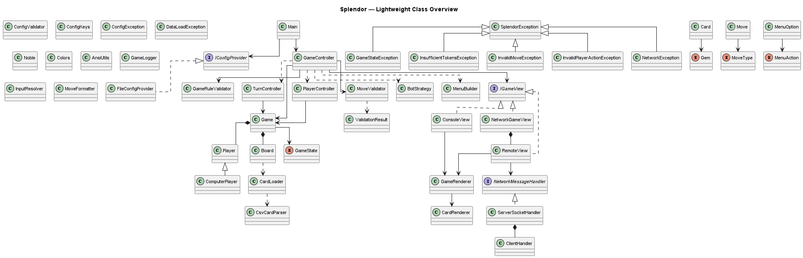

# Splendor (Java Implementation)

Project guide and Java API: https://hongyime.github.io/playsplendor/

The hosted site contains documentation. Run the Java console game on your computer; TCP multiplayer requires a separately running Java server.


A modular, strictly MVC-based implementation of the board game Splendor in Java.

## Quick Start

```bash
# Install a JDK 17 or newer, then clone or download this repository.
# Build the project
./compile.sh    # Unix/macOS
.\compile.bat   # Windows

# Run the game (console mode)
./run.sh        # Unix/macOS
.\run.bat       # Windows

# Run in server mode (network multiplayer)
java -cp classes com.splendor.Main --server
```

> Looking for multiplayer lobby setup steps? Jump to **Network Multiplayer → "4. Network Lobby Setup Walkthrough (Recommended)"**.

## Table of Contents
- [Features](#features)
- [Quick Start](#quick-start)
- [Architecture Overview](#architecture-overview)
- [Gameplay Flow](#gameplay-flow)
- [How to Play](#how-to-play)
- [Getting Started](#getting-started)
- [Network Multiplayer](#network-multiplayer)
- [Configuration](#configuration)
- [Testing](#testing)
- [Project Structure](#project-structure)
- [Contributing](#contributing)
- [AI Attribution](#ai-attribution)
- [License](#license)

## Features

- **MVC Architecture**: Strict separation of concerns between Model, View, and Controller.
- **Custom Exception Handling**: Robust error management using the `SplendorException` hierarchy.
- **Configurable**: Game rules and setup parameters loaded from `src/resources/config.properties`.
- **Console Interface**:
  - **ASCII Dashboard**: Cards and game state are rendered in a clean, frame-based dashboard.
  - **Color Support**: Gems and player info are color-coded (Red, Green, Blue, White, Black, Gold).
  - **Smart Menus**: Options are dynamically enabled or disabled based on game state.
  - **Interactive Prompts**: Intuitive sub-menus for selecting gems and cards.
  - **Undo Feature**: Allows players to undo their last turn by typing `Z` or `UNDO`.
- **Network Support**: Multiplayer capabilities via TCP sockets.
- **Bot/CPU Players**: Name a player with "bot" in the name to enable computer-controlled opponents.
- **Automated Documentation**: Current Javadoc is built and validated before GitHub Pages deployment.

## Architecture Overview

The project follows a strict MVC pattern to ensure separation of concerns. The Controller layer orchestrates the game logic by delegating specific tasks to specialized sub-controllers and validators.

The archived diagrams below were recovered from the project's Git history. They document an earlier design and are preserved as reference; the [generated Java API](https://hongyime.github.io/playsplendor/docs/javadoc/index.html) reflects the current source.



[PlantUML source](site/diagrams/splendor-class-light.puml) · [All five diagrams and sources](https://hongyime.github.io/playsplendor/#archive)

## Gameplay Flow

Choose an available action, select the gems or card requested by the prompt, and confirm the move. The controllers validate it before applying end-of-turn noble and token-limit checks. Invalid inputs return to the relevant prompt.

## How to Play

### Objective

The goal is to be the first player to reach 15 prestige points (configurable). Points are earned by purchasing development cards and attracting noble tiles.

### Setup

The game scales based on the number of players (2-4):

| Players | Gem Tokens per Color | Nobles Available |
|---------|---------------------|------------------|
| 2       | 4                   | 3                |
| 3       | 5                   | 4                |
| 4       | 7                   | 5                |

### Actions (one per turn)

1. **Take 3 Different Gems**: Pick 1 gem each of 3 different colors (no Gold).
2. **Take 2 Same Gems**: Pick 2 gems of the same color (only if ≥4 available).
3. **Reserve a Card**: Take a face-up card or draw from a deck (max 3 reserved).
4. **Buy a Card**: Purchase a face-up card using your gems and discounts.
5. **Buy Reserved Card**: Purchase a card you previously reserved.

### Nobles

At end of turn, if your gem bonuses (from purchased cards) meet a Noble's requirements, that Noble visits you automatically (+3 points).

### Winning

Game ends when a player reaches 15+ points. The current round finishes so all players get equal turns. Tiebreaker: fewest purchased cards.

### Token Limit

Max 10 tokens (including Gold). Must discard down to 10 at end of turn.

### Undo

After your move executes, type `Z` or `UNDO` to revert your turn and try again.

### Bot Players

Include "bot" in a player's name (e.g., "Bot1", "AngryBot") to make them a computer-controlled opponent.

## Getting Started

### Prerequisites

- Java JDK 17 or higher for the game and tests. The JUnit console runner is included in `lib/`.
- Python 3.9 or higher for the documentation builder and Bash runner fixtures.

The normal build, test and documentation commands do not install packages or download diagram tools. The old `setup_requirements.*` scripts are optional legacy diagram-tool bootstraps; they are not needed for these commands.

### Building

**Windows:**
```batch
.\compile.bat
```

**Unix/macOS:**
```bash
./compile.sh
```

### Running the Game

**Console Mode (Single Player or Local Multiplayer):**

Windows:
```batch
.\run.bat
```

Unix/macOS:
```bash
./run.sh
```

**Server Mode (Network Multiplayer):**

```bash
java -cp classes com.splendor.Main --server
```

## Network Multiplayer

Multiplayer is supported via a custom TCP protocol. The server manages the game state and broadcasts updates to all connected clients.

### 1. Start the Server

The server auto-discovers a free port and displays connection addresses.

```bash
java -cp classes com.splendor.Main --server
```

### 2. Connect as Client

**Netcat (WSL/Linux/macOS):**
```bash
nc <server-ip> <port>
```

**PowerShell (Windows):**
```powershell
powershell -Command "(New-Object System.Net.Sockets.TcpClient).Connect('<server-ip>', <port>)"
```

### 3. Network Input Style (Current)

The current server/client flow is **prompt-driven**. Connected clients submit plain responses to prompts (menu choice numbers, gem codes, card IDs, tier IDs, discard inputs), rather than sending fixed `MOVE:...` command frames.

Common remote inputs:
- `1`, `2`, `3`, etc. for menu selections.
- Gem selections like `R G B` (or `AU` for gold where allowed by prompt).
- Numeric card IDs / tier IDs when prompted.
- `Z` or `UNDO` to return to the previous prompt/menu.
- `DISCARD:R B` (legacy accepted) or pair format like `R 1 B 1` during discard prompts.

Low-level protocol utilities still validate message prefixes such as `MOVE:`, `QUERY:`, and `DISCONNECT`, but gameplay input in this implementation is consumed as prompt responses by the remote view/client handler flow.

### 4. Network Lobby Setup Walkthrough (Recommended)

Use this flow to keep setup predictable and reduce terminal line collisions when multiple users connect close together:

1. **Host starts server**
   - Run `java -cp classes com.splendor.Main --server`.
   - Wait for `Waiting for host to connect...`.
2. **Host connects first**
   - Connect using `nc <server-ip> <port>`.
   - The host terminal will show:
     - `Welcome to Splendor Network Game!`
     - `You are the lobby leader.`
     - `Please choose total players (2-4). Other players will wait for your choice.`
   - Then enter the player count when prompted.
3. **Other players connect**
   - After host selects player count, remaining players connect with `nc`.
   - Lobby status is shown (`Lobby: X/Y players joined...`) until full.
4. **Name setup (30-second timeout)**
   - Everyone gets a name prompt and can type a preferred name.
   - If a player does not submit within 30 seconds, default `PlayerN` is assigned automatically.
   - To avoid disrupting users mid-typing, status now updates as a full waiting-room snapshot rather than reprinting on each single name change.
5. **Ready confirmation**
   - All clients see `Press Enter to confirm readiness and continue.`
   - Press Enter to proceed into the match.

Tips:
- Prefer one response per prompt; avoid pasting multiple lines at once.
- If text looks offset in `nc`, press Enter once to re-sync your terminal input line.

## Configuration

Game settings in `src/resources/config.properties`:

| Setting | Default | Description |
|---------|---------|-------------|
| `game.points.win` | 15 | Points required to win |
| `game.tokens.max` | 10 | Maximum tokens per player |
| `game.tokens.2p` | 4 | Gem tokens per color (2 players) |
| `game.tokens.3p` | 5 | Gem tokens per color (3 players) |
| `game.tokens.4p` | 7 | Gem tokens per color (4 players) |
| `game.nobles.base` | 3 | Base number of nobles |
| `game.nobles.add` | 1 | Additional nobles per player |
| `game.reserved.max` | 3 | Maximum reserved cards |

## Testing

### Running Tests

Prerequisites:
- Install a JDK 17 or newer. The bundled JUnit runner is used directly.
- By default, `test/run_tests.(sh|bat)` excludes `com.splendor.network` integration tests to avoid blocking automated/local pipelines.
- To include network tests explicitly, pass `--include-network`.

**Windows:**
```batch
test\run_tests.bat
```

**Unix/macOS:**
```bash
bash test/run_tests.sh
```

Run a specific class:
```bash
bash test/run_tests.sh --class com.splendor.util.MoveFormatterTest
```

Run by package/category:
```bash
bash test/run_tests.sh --category com.splendor.model
```

### Test Coverage

The test suite uses JUnit 5 and covers:

- **Model Layer**: Game state, player actions, card mechanics
- **Validators**: Move validation, rule enforcement
- **Controllers**: Turn logic, game flow
- **Edge Cases**: Invalid inputs, boundary conditions
- **Documentation**: Generate real Javadoc, check every source type and package, and validate the five preserved diagram pairs

CI runs the full non-network suite on both Linux and Windows with Java 17 from a checkout path containing spaces. Six synthetic Bash runner checks also cover argument boundaries, explicit network opt-in, selectors, exclusion patterns and failure exit codes. Selecting no tests fails the command. Network integration tests remain explicitly opt-in.

### Where the test code lives

- `test/com/splendor/controller/` — controller/game flow behavior tests
- `test/com/splendor/model/` — model/game state and strategy tests
- `test/com/splendor/model/validator/` — move/rule validation tests
- `test/com/splendor/network/` — network integration tests
- `test/com/splendor/test/` — documentation/config helper tests

### Script parity (.sh and .bat)

Windows `.bat` counterparts exist for the main shell scripts:
- `compile.sh` ↔ `compile.bat`
- `run.sh` ↔ `run.bat`
- `setup_requirements.sh` ↔ `setup_requirements.bat`
- `generate_docs_enhanced.sh` ↔ `generate_docs_enhanced.bat`
- `test/run_tests.sh` ↔ `test/run_tests.bat`
- `test/ci/generate_javadoc.sh` ↔ `test/ci/generate_javadoc.bat`
- `test/ci/docs_guard.sh` ↔ `test/ci/docs_guard.bat`
- `test/ci/docs_pipeline.sh` ↔ `test/ci/docs_pipeline.bat`
- `test/ci/verify_javadoc_index.js` ↔ `test/ci/verify_javadoc_index.bat` (wrapper)
- `test/ci/verify_diagram_assets.py` ↔ `test/ci/verify_diagram_assets.bat` (wrapper)
- `test/network/network_three_terminal_test.sh` ↔ `test/network/network_three_terminal_test.bat`
- `generate_auto_uml.sh` ↔ `generate_auto_uml.bat`

## Project Structure

```text
splendor/
├── compile.bat / compile.sh      # Java 17-compatible build
├── run.bat / run.sh              # Console game
├── index.html                   # Project guide source
├── scripts/build_site.py        # Isolated static-site build and link validation
├── site/
│   ├── style.css                # Prawn visual style
│   └── diagrams/                # Archived PNG/PlantUML pairs and provenance
├── src/
│   ├── com/splendor/            # MVC game, networking and utilities
│   └── resources/              # Original card CSV and configuration
├── lib/                        # Bundled JUnit runner
└── test/                       # Game, documentation and runner tests
```

## Contributing

### Getting Started

1. Fork the repository
2. Create a feature branch (`git checkout -b feature/amazing-feature`)
3. Commit your changes (`git commit -m 'Add amazing feature'`)
4. Push to the branch (`git push origin feature/amazing-feature`)
5. Open a Pull Request

### Code Conventions

- **Architecture**: Strict MVC. Model has no I/O, View is interface-based, Controller orchestrates.
- **Documentation**: All public APIs must have Javadoc comments.
- **Testing**: Write unit tests for new functionality.
- **Style**: Follow Java naming conventions and Google Java Style Guide.

### CI/CD and documentation

Run the tests, then build the complete static site:

```bash
bash test/run_tests.sh
python3 scripts/build_site.py
```

On Windows:

```batch
test\run_tests.bat
python scripts\build_site.py
```

The builder prints the new output directory. Open its `index.html`, or serve that directory with `python -m http.server --bind 127.0.0.1 --directory <output-directory>` for local browsing. To choose a destination, use `--output <empty-directory>`; existing populated output directories are rejected so old artifacts cannot silently mix with a new build.

The builder uses the installed JDK to generate API pages for every current Java source type, copies the guide and archived diagrams, validates local file links, and writes `release.json` with the Git commit and file hashes. It preserves the published `docs/javadoc/index.html` URL. No Node, PlantUML, Supabase or Vercel runtime is required by this static site.

`generate_docs_enhanced.*` and `test/ci/docs_pipeline.*` delegate to this builder and accept the same options. Older standalone diagram scripts remain available for historical authoring workflows; they are not part of the normal build.

`.github/workflows/documentation.yml` calls the reusable Linux/Windows test workflow, builds a small static artifact, and deploys it to GitHub Pages only from `main` after checks pass. Pull requests build and validate without production deployment. Generated API files stay in the build artifact; only guide source and preserved diagram assets are tracked. Source and site changes trigger a build, with no scheduled refresh or application database requests.

### Reporting Issues

Open a GitHub Issue with:
- Clear description of the problem
- Steps to reproduce
- Expected vs actual behavior
- Java version and OS

## AI Attribution

This project was developed with the assistance of AI tools for code generation, documentation, and testing.

## License

Apache-2.0. See [LICENSE](LICENSE) and [NOTICE](NOTICE).
